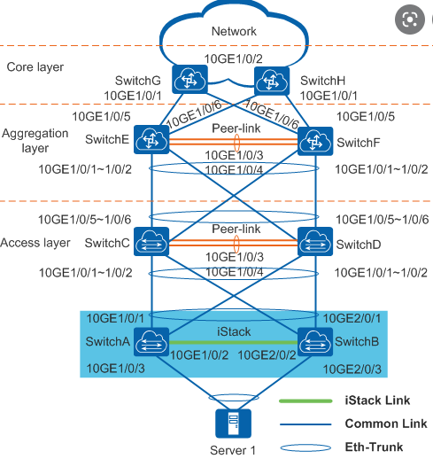

Ломовейшая статья - разобрать

https://ipttl.blogspot.com/2017/01/cisco-nexus-vpc-fex.html


#### dfs-group и m-lag

#### vPC и Port channel

это одно и тоже, одно - huawei, другое - cisco

m-lag-ом можно объединять свитчи пары свитчей (как и с помощью vPC = Back-to-Back vPC) или опускать на отдельностоящий свитч и ловить на нем лацпом (как и vPC)





----------------------------------------

Далее про m-lag

##### Сначала включаем stp , инчае peer-link не заведется
```
stp mode rstp
stp v-stp enable
```

#### Создаем dfs-group:

```
#
dfs-group 1
 priority 125
 source ip 172.17.8.62 vpn-instance MGMT
 consistency-check enable mode loose
 dual-active detection enhanced enable
#
```
#### На втором свитче приоритет больше или меньше выставляем

#### Задаем статический мак, которым будет прикидываться эта пара - типа один свитч

```
lacp m-lag system-id 0013-0013-0013
```


#### Создаем VRF (раз уж мы её используем)

```
#
ip vpn-instance MGMT
 ipv4-family
#
```
#### И интерфейс управленя, через который пара будет снюхиваться

```
#
interface MEth0/0/0
 ip binding vpn-instance MGMT
 ip address 172.17.1.62 255.255.255.0
#
```
#### Маршрут - чисто для MGMT

```
#
ip route-static vpn-instance MGMT 172.17.0.0 255.255.0.0 172.17.1.1
#
```

#### Создаем peer-link

```
#
interface Eth-Trunk0
 mode lacp-static
 stp edged-port enable
 peer-link 1
#
```

Если stp на пирлинке не включить, peer-link будет сапрессед:
```
<huawei>displ int br
PHY: Physical
*down: administratively down
^down: standby
(l): loopback
(s): spoofing
(b): BFD down
(e): ETHOAM down
(d): Dampening Suppressed
(p): port alarm down
(dl): DLDP down
(c): CFM down
(sd): STP instance discarding
InUti/OutUti: input utility rate/output utility rate
Interface                  PHY      Protocol  InUti OutUti   inErrors  outErrors
Eth-Trunk0               up       up(sd)    0.01%  0.01%          0          0
  100GE1/0/1               up       up        0.01%  0.01%          0          0
  100GE1/0/2               up       up        0.01%  0.01%          0          0
```

#### Создаем несколько m-lag

```
interface Eth-Trunk1
 mode lacp-static
 dfs-group 1 m-lag 1
#
interface Eth-Trunk5
 mode lacp-static
 dfs-group 1 m-lag 5
#
```

#### Тут пару m-lag , на другом свитче тоже самое

```
#
interface 25GE1/0/1
 undo shutdown
 eth-trunk 1
 device transceiver 25GBASE-FIBER
#
interface 25GE1/0/5
 undo shutdown
 eth-trunk 5
 device transceiver 25GBASE-FIBER
#
```

#### Далее peer-link:

```
#
interface 100GE1/0/1
 ubdo shutdown
 eth-trunk 0
 device transceiver 100GBASE-FIBER
#
interface 100GE1/0/2
 undo shutdown
 eth-trunk 0
 device transceiver 100GBASE-FIBER
#
```
