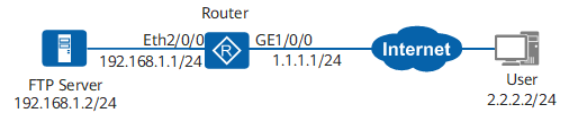

#### As shown in Figure 3-8, the router functions as the gateway of a company, and the FTP server is an internal server. The company requires that external users can access the internal FTP server and the internal network does not need to import routes of the external network through translation of public network addresses.

Figure 3-8 Networking diagram




Procedure
Configure the router.
```bash
#                                                                               
acl number 3000  
 rule 5 permit ip source 2.2.2.0 0.0.0.255      //Allow only users on the specified network segment to access the internal server.
#                                                                               
 nat alg ftp enable                    //Enable the NAT application level gateway (ALG) function for FTP.     
#                                                                               
interface Ethernet2/0/0                                                         
 ip address 192.168.1.1 255.255.255.0  
 nat outbound 3000                 //Configure outbound NAT to translate the source IP address used when external users access the internal network and ensure that the internal network does not need to import routes of the external network.
#                                                                               
interface GigabitEthernet1/0/0                                                  
 ip address 1.1.1.1 255.255.255.0                                           
 nat server protocol tcp global 1.1.1.3 ftp inside 192.168.1.2 ftp      //Configure the NAT server function on the outbound interface to ensure that external users can access the internal server.  
#                                                                               
 ip route-static 0.0.0.0 0.0.0.0 1.1.1.2        //Configure a static route and ensure that the next-hop address of packets from the internal network to external network is 1.1.1.2.
#
return 
```

###Verify the configuration.
#### Run the  command on the router to check NAT server information.
```bash
display nat server
```
#### Run the  command on the router to check outbound NAT information.
```bash
display nat outbound
```
